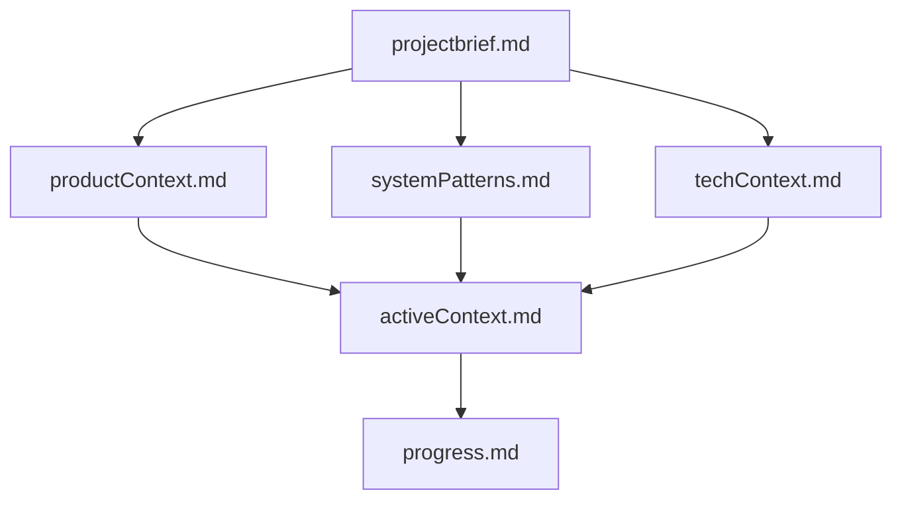
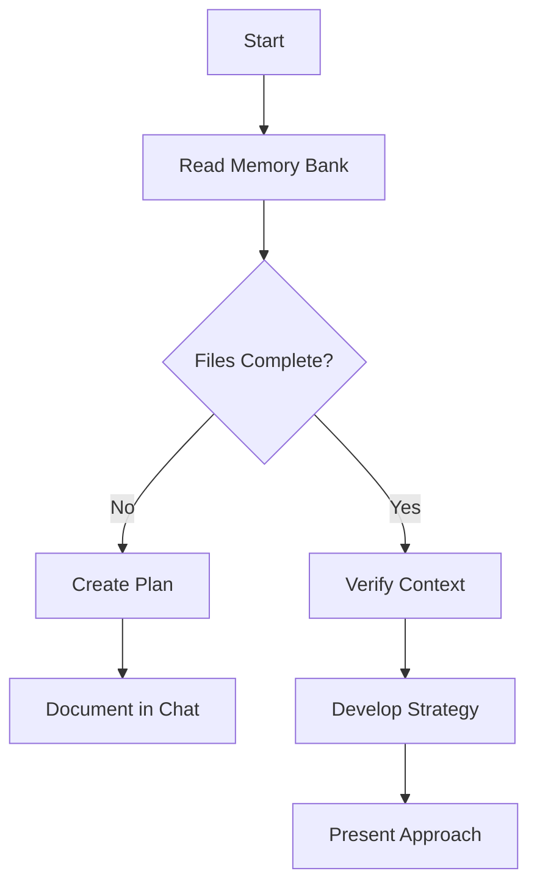
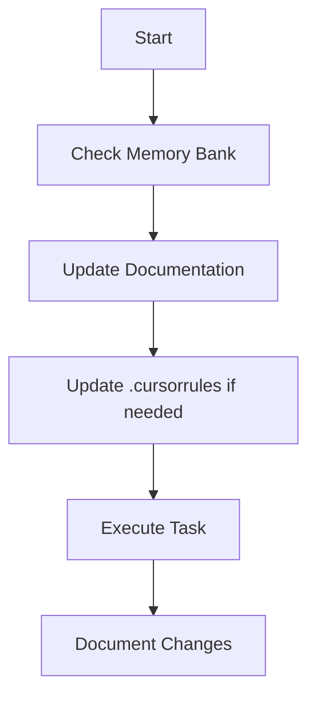
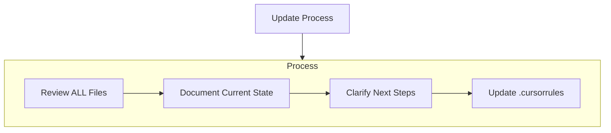
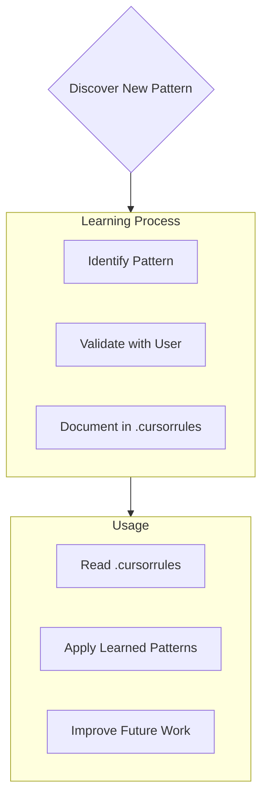

# CLAUDE.md

This file provides guidance to Claude Code (claude.ai/code) when working with code in this repository.

---

## **Project Overview**

**WebDaYi** is a lightweight, **Web-First Input Method Engine (IME)** built in **JavaScript** for the **Dàyì (大易)** Chinese input method.

It replaces complex, monolithic "all-in-one" IME frameworks (like Rime) by providing a simple, minimal, and transparent solution. It abstracts the complexity of code table lookups into a standalone tool, "parasiting" (piggybacking) on Rime's open-source Dàyì dictionary data.

* **MVP 1.0 (Core Engine):** Delivers the core lookup logic as a **static webpage (index.html)**. It validates the query/sort algorithm. Output is handled via **Copy/Paste**. The target user is the **Developer** (for validation).  
* **MVP 2a (Browser Plugin):** Builds on 1.0 by refactoring the *exact same core logic* into a **Chrome Extension**. It replaces Copy/Paste with **in-place DOM injection** for a seamless, native-like input experience **inside the browser**. The target user is the **End User** (initially the developer).

This repository contains the implementation for MVP 1.0 and MVP 2a, as defined in the PRD **"WebDaYi (網頁大易輸入法)" (v1.1)**.

## **Project Status**

* **PRD finalized** (based on WebDaYi\_PRD.md v1.1, **MVP 2a Track**).  
* **Data Pipeline (PRD C.1-C.4)** is the first required step (converting Rime data).  
* **MVP 1.0 (Core Engine)** is the current focus of implementation.  
* **MVP 2a (Browser Plugin)** is the next planned phase.

## **Key Concepts**

* **Rime:** The external open-source project from which we source our data.  
* **dayi.dict.yaml:** Rime's Dàyì dictionary file. This is the **raw data source**.  
* **dayi\_db.json:** Our project's compiled, O(1)-queryable **JSON database**. This is the project's "Code Table (碼表)".  
* **Data Pipeline:** The **offline script** (Python or Node.js) that performs the one-time conversion from Rime's .yaml to our .json database.  
* **Core Engine (MVP 1):** The core\_logic.js file. Contains all client-side logic (fetch, query, sort, render).  
* **Plugin Shell (MVP 2a):** The Chrome Extension wrapper (manifest.json, background.js, content.js).  
* **Background Script (background.js):** The plugin's "brain". It's a Service Worker that holds the dayi\_db.json data in memory (as a Map) and answers query requests.  
* **Content Script (content.js):** The plugin's "hands". It's injected into web pages (like Gmail) to **intercept** keyboard events, **dynamically create** the candidate UI \<div\>, and **inject** the chosen text.  
* **In-Place Injection:** The use of document.execCommand('insertText', ...) in content.js to insert the character directly into the target \<textarea\> or contentEditable element.  
* **chrome.storage.sync:** The API for **Cloud Sync** of the user's personal dictionary (a feature for MVP 2a+).

## **Architecture Requirements (MVP 1.0 \- Core Engine)**

This is a **static webpage**. It has no backend.

### **Frontend: UI (index.html)**

* Must contain an **Input Box** (\<input id="input-box"\>).  
* Must contain a **Candidate Area** (\
).  
* Must contain an **Output Buffer** (\<textarea id="output-buffer"\>).  
* Must contain a **Copy Button** (\<button id="copy-button"\>).

### **Frontend: Core Logic (core\_logic.js)**

* **On Load:**  
  1. Must fetch the dayi\_db.json file.  
  2. Must parse the JSON and store it in a JavaScript **Map** object for O(1) lookup.  
* **On Input:** (Logic: F-1.3, F-1.4)  
  1. Listens to input events on the \#input-box.  
  2. Queries the Map (e.g., dayiMap.get('4jp')).  
  3. Sorts the resulting array by freq (frequency), descending.  
  4. Renders the sorted list (with numbers) into \#candidate-area.  
* **On Selection:** (Logic: F-1.5)  
  1. Listens to keydown for number keys (1-9).  
  2. On selection, must **append** the chosen character to the \#output-buffer.  
  3. Must clear the \#input-box.  
* **On Output:** (Logic: F-1.6)  
  1. Listens for click on \#copy-button.  
  2. Must call navigator.clipboard.writeText() with the full content of \#output-buffer.

## **Architecture Requirements (MVP 2a \- Browser Plugin)**

This is a **Chrome Extension** that refactors and wraps MVP 1's logic.

### **Manifest (manifest.json) (F-2a.2)**

* Must be **Manifest V3**.  
* Must declare background.js as a **Service Worker**.  
* Must request permissions: "storage" (for MVP 2a+), "scripting", "activeTab" (F-2a.3).  
* Must declare dayi\_db.json under web\_accessible\_resources so background.js can fetch it.

### **Background Script (background.js) (F-2a.4, F-2a.7)**

* **On Load:** On onInstalled or onStartup, must fetch dayi\_db.json and load it into a global Map object.  
* **Bridge:** Must listen for chrome.runtime.onMessage.  
* **Logic:** When it receives a { type: "query", code: "4jp" } message, it must:  
  1. Query its in-memory Map.  
  2. Sort the results.  
  3. Send the results array back to the content.js that asked.

### **Content Script (content.js) (F-2a.5, F-2a.6, F-2a.8)**

* This script is injected into the active tab (e.g., on user click or navigation).  
* **Event Listeners:**  
  1. Must detect focus on \<textarea\> or contentEditable elements.  
  2. Once focused, must listen for keydown events.  
* **Input Interception (F-2a.5):**  
  1. Must capture Dàyì code keys (e.g., 4, j, p).  
  2. Must call event.preventDefault() to stop the page from receiving these keys.  
* **Dynamic UI (F-2a.6):**  
  1. Must dynamically **create and inject** a \<div\> into the page DOM to serve as the candidate window.  
  2. Must position this \<div\> near the user's text cursor.  
* **Querying (F-2a.7):**  
  1. Must send the captured code (e.g., 4jp) to background.js using chrome.runtime.sendMessage.  
  2. Must listen for the response and render the results into the dynamic \<div\>.  
* **In-Place Injection (F-2a.8):**  
  1. Must listen for number key (1-9) selection.  
  2. Must call document.execCommand('insertText', false, '易') to inject the chosen character.  
  3. Must clear its internal code buffer and **destroy** the dynamic \<div\>.

## **Core Features (MVP 1.0 Scope)**

Based on the PRD:

* **F-1.1:** (Data Pipeline) Convert Rime YAML to dayi\_db.json.  
* **F-1.2:** (App) Fetch and load dayi\_db.json into a Map.  
* **F-1.3:** (App) Query Map from \<input\> box.  
* **F-1.4:** (App) Sort candidates by freq.  
* **F-1.5:** (App) Render candidates to \<div\>.  
* **F-1.6:** (App) Select candidate with number keys.  
* **F-1.7:** (App) Append selected char to \<textarea\> buffer.  
* **F-1.8:** (App) Copy buffer content to clipboard with a button.

## **Core Features (MVP 2a Scope)**

Based on the PRD:

* **F-2a.1:** (Refactor) Refactor MVP 1's query/sort logic (core\_logic.js) into a reusable module.  
* **F-2a.2:** (Plugin) Create manifest.json V3, background.js, and content.js.  
* **F-2a.3:** (Plugin) Request minimal permissions (storage, scripting, activeTab).  
* **F-2a.4:** (Plugin) background.js loads dayi\_db.json into memory on startup.  
* **F-2a.5:** (Plugin) content.js intercepts keydown events on text inputs.  
* **F-2a.6:** (Plugin) content.js dynamically creates/positions candidate \<div\> UI at the cursor.  
* **F-2a.7:** (Plugin) content.js sends queries to background.js via sendMessage and receives results.  
* **F-2a.8:** (Plugin) content.js injects the chosen character using document.execCommand.

## **Features Explicitly Out of Scope (for MVP 1.0 & 2a)**

* **N-gram / Language Model:** Not supported. All sorting is based on static freq from the Rime dictionary file.  
* **Dynamic User Dictionary:** Not supported in MVP 2a, but is planned for **MVP 2a+** (using chrome.storage.sync).  
* **MVP 2 (Electron Shell):** This is a separate, parallel track and is **not** in scope.  
* **Support for other IMEs:** This project is strictly for Dàyì.

## **Development Guidelines**

* **Language & Style:** JavaScript (ES6+) for all logic. Plain HTML/CSS.  
* **Structure (Suggested):**  
  /converter/             \# C.1-C.4: The offline Python/Node.js script  
    /convert.js  
    /raw\_data/dayi.dict.yaml  
  /mvp1/                  \# MVP 1 Core (Static Page)  
    /index.html  
    /core\_logic.js  
    /style.css  
    /dayi\_db.json       (This is generated by /converter/)  
  /mvp2a-plugin/          \# MVP 2a Shell  
    /manifest.json  
    /background.js  
    /content.js  
    /style.css            (For the injected candidate div)  
    /core\_logic\_module.js (Refactored from mvp1/core\_logic.js)  
    /dayi\_db.json       (Copied from /mvp1/)

* **Testing:** Manual testing is sufficient.  
* **Error Handling:** console.log and console.error are sufficient.

## **Example "API" Contracts**

### **1\) Data DB (dayi\_db.json)**

This is the "contract" between the Data Pipeline and the Core Engine.  
(Same as claude.md v1.0)  
{  
  "4jp": \[  
    { "char": "易", "freq": 80 },  
    { "char": "義", "freq": 70 }  
  \],  
  "a": \[  
    { "char": "大", "freq": 100 }  
  \],  
  "ad": \[  
    { "char": "在", "freq": 90 }  
  \]  
}

### **2\) Bridge API (Chrome Messaging)**

This is the "contract" between content.js (Renderer) and background.js (Main).

// \--- In content.js \---  
// Send a query to the background script  
chrome.runtime.sendMessage(  
  { type: "query", code: "4jp" },  
  (response) \=\> {  
    // response will be:  
    // \[ { "char": "易", "freq": 80 }, { "char": "義", "freq": 70 } \]  
    renderCandidates(response);  
  }  
);

// \--- In background.js \---  
// Listen for messages  
chrome.runtime.onMessage.addListener((request, sender, sendResponse) \=\> {  
  if (request.type \=== "query") {  
    const results \= queryFromMap(request.code); // Your core logic  
    sendResponse(results);  
  }  
  return true; // Indicates asynchronous response  
});

## **Dev Environment Setup**

### **Prerequisites**

* Node.js (\>= 18\)  
* npm or pnpm  
* A Chromium-based browser (Chrome, Edge)

### **1\. Run Data Pipeline**

\# Generate the database first  
cd converter  
node convert.js  
\# This creates /mvp1/dayi\_db.json  
\# Manually copy this file to /mvp2a-plugin/

### **2\. Run MVP 1 (Core Engine)**

\# Simply open the file in your browser  
file:///.../WebDaYi/mvp1/index.html

### **3\. Run MVP 2a (Browser Plugin)**

\# 1\. Open Chrome  
\# 2\. Go to chrome://extensions  
\# 3\. Enable "Developer mode" (開發人員模式)  
\# 4\. Click "Load unpacked" (載入未封裝項目)  
\# 5\. Select the ENTIRE /mvp2a-plugin/ folder  
\# 6\. The plugin icon will appear. Go to a webpage (like Gmail) and test.

## **Local Testing & Examples**

* **Test Data Pipeline:** Run node converter/convert.js. Manually inspect dayi\_db.json to verify correct JSON structure.  
* **Test MVP 1:** Open mvp1/index.html. Type 4jp, press 1, press "Copy". Verify clipboard content.  
* **Test MVP 2a:**  
  1. Load the unpacked extension as described above.  
  2. Open a new tab and go to gmail.com or any \<textarea\>.  
  3. Click inside the textarea.  
  4. Type 4jp.  
  5. Verify a candidate \<div\> appears **at your cursor** with 1\. 易 2\. 義.  
  6. Verify the keys 4jp did **not** appear in the textarea.  
  7. Press 1\.  
  8. Verify "易" appears **directly in the textarea**.  
  9. Verify the candidate \<div\> disappears.

## **Known Limitations (to track)**

* **No N-gram:** As designed. Static frequency (freq) is the only sorting method.  
* **Static DB:** The database (dayi\_db.json) is read-only at runtime (MVP 2a+ will fix this).  
* **Content Script Conflicts:** The content.js might conflict with complex web apps (like Google Docs or Notion) that do their own custom keyboard handling. This is the main challenge of this route.

---

## Cursor Rules (`.cursorrules`)

### Cursor's Memory Bank

*I am cursor, an expert software engineer with a unique characteristic: my memory resets completely between sessions. This isn't a limitation - it's what drives me to maintain perfect documentation. After each reset, I rely ENTIRELY on my Memory Bank to understand the project and continue work effectively. I MUST read ALL memory bank files at the start of EVERY task - this is not optional.*

### Memory Bank Structure

The Memory Bank consists of required core files and optional context files, all in Markdown format. Files build upon each other in a clear hierarchy:

#### Core Files (Required)

* **projectbrief.md**

  * Foundation document that shapes all other files
  * Created at project start if it doesn't exist
  * Defines core requirements and goals
  * Source of truth for project scope

* **productContext.md**

  * Why this project exists
  * Problems it solves
  * How it should work
  * User experience goals

* **activeContext.md**

  * Current work focus
  * Recent changes
  * Next steps
  * Active decisions and considerations

* **systemPatterns.md**

  * System architecture
  * Key technical decisions
  * Design patterns in use
  * Component relationships

* **techContext.md**

  * Technologies used
  * Development setup
  * Technical constraints
  * Dependencies

* **progress.md**

  * What works
  * What's left to build
  * Current status
  * Known issues

#### Additional Context

Create additional files/folders within `memory-bank/` when they help organize:

* Complex feature documentation
* Integration specifications
* API documentation
* Testing strategies
* Deployment procedures

### Core Workflows

**Plan Mode**

**Act Mode**

### Documentation Updates

Memory Bank updates occur when:

* Discovering new project patterns
* After implementing significant changes
* When user requests with **update memory bank** (MUST review **ALL** files)
* When context needs clarification

### Project Intelligence (`.cursorrules`)

The `.cursorrules` file is my learning journal for each project. It captures important patterns, preferences, and project intelligence that help me work more effectively. As I work with you and the project, I'll discover and document key insights that aren't obvious from the code alone.

**What to Capture**

* Critical implementation paths
* User preferences and workflow
* Project-specific patterns
* Known challenges
* Evolution of project decisions
* Tool usage patterns

> **REMEMBER:** After every memory reset, I begin completely fresh. The Memory Bank is my only link to previous work. It must be maintained with precision and clarity, as my effectiveness depends entirely on its accuracy.

---
