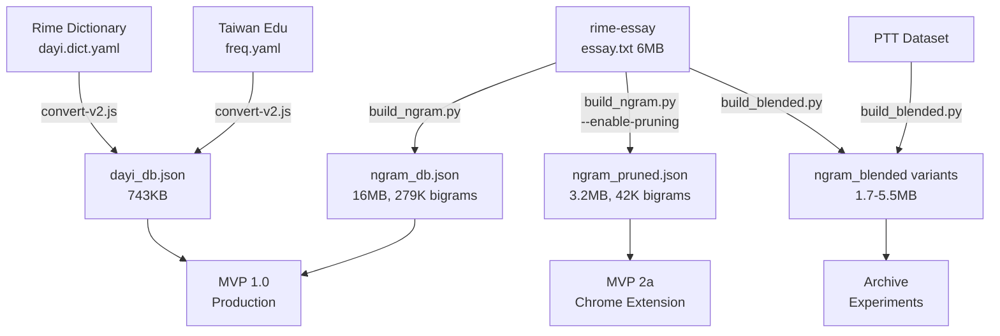

# WebDaYi Data Pipeline

WebDaYi 資料處理管線完整文件 - 從原始語料到生產資料庫的轉換流程。

## 📖 TL;DR

**生產資料庫** (位於 `mvp1/`):
- `dayi_db.json` (743KB) - 大易字典 [來源: Rime]
- `ngram_db.json` (16MB) - 完整 N-gram [來源: rime-essay, **生產使用**]
- `ngram_pruned.json` (3.2MB) - 壓縮 N-gram [預備 MVP 2a 使用]

**建構工具** (位於 `converter/`):
- `convert-v2.js` - 大易字典轉換器 (含頻率排序)
- `build_ngram.py` - N-gram 資料庫建構器 (含剪枝選項)

---

## 📊 資料管線架構



---

## 🗂️ 資料庫總覽

### 生產資料庫 (mvp1/)

| 檔案 | 大小 | 用途 | 來源 | 建構器 | 狀態 |
|------|------|------|------|--------|------|
| `dayi_db.json` | 743KB | 大易字典 | Rime | convert-v2.js | ✅ 生產 |
| `ngram_db.json` | 16MB | 完整 N-gram | rime-essay | build_ngram.py | ✅ **生產** |
| `ngram_pruned.json` | 3.2MB | 壓縮 N-gram | rime-essay | build_ngram.py --enable-pruning | ⏳ MVP 2a |
| `version.json` | 14KB | 版本資訊 | - | 手動維護 | ✅ 生產 |

### 歸檔資料庫 (data/archive/)

| 目錄 | 檔案數 | 總大小 | 說明 |
|------|--------|--------|------|
| `ngram_blended_experiments/` | 6 | 19MB | Session 9 混合模型實驗 |
| `ngram_alternatives/` | 1 | 5.4MB | 台灣特化版本實驗 |

完整歸檔說明請參閱：[data/archive/README.md](archive/README.md)

---

## 🔨 Pipeline 1: 大易字典轉換

### 輸入資料

1. **dayi.dict.yaml** (來自 Rime)
   - 位置：`converter/raw_data/dayi.dict.yaml`
   - 格式：YAML (字元 → 字碼映射)
   - 大小：~2MB
   - 內容：13,926 個字元，1,584 個字碼

2. **freq.yaml** (台灣教育部)
   - 位置：`converter/raw_data/freq.yaml`
   - 格式：TSV (字元 → 排名)
   - 內容：前 2000 個最常用繁體中文字
   - 範例：
     ```tsv
     的	1
     不	2
     一	3
     我	4
     是	5
     ...
     ```

### 轉換器版本

#### v1 (convert.js) - 基礎轉換器
- **頻率計算**：基於 YAML 順序 (freq = 100 - index)
- **優點**：簡單，無需額外資料
- **缺點**：不反映真實使用頻率
- **狀態**：⚠️ 已被 v2 取代

#### v2 (convert-v2.js) - 增強轉換器 ✨ **推薦**
- **頻率計算**：基於台灣教育部頻率排名
- **演算法**：
  ```javascript
  BASE_FREQ = 10000    // Rank 1
  MIN_FREQ = 8000      // Rank 2000
  DEFAULT_FREQ = 1000  // 不在排名中

  freq = BASE_FREQ - (rank - 1) * (BASE_FREQ - MIN_FREQ) / 1999
  ```
- **優點**：候選字排序符合實際使用習慣
- **狀態**：✅ 生產使用

### 輸出格式

**dayi_db.json** 範例：
```json
{
  "v": [
    { "char": "大", "freq": 9992 },  // Rank 9
    { "char": "夫", "freq": 9544 },  // Rank ~500
    { "char": "禾", "freq": 1000 }   // 不在排名
  ],
  "4jp": [
    { "char": "易", "freq": 9992 },
    { "char": "義", "freq": 9544 }
  ]
}
```

### 建構指令

```bash
cd converter

# 使用 v2 增強轉換器（推薦）
node convert-v2.js

# 測試
node convert-v2.test.js  # 應顯示 21/21 passed

# 驗證輸出
ls -lh ../mvp1/dayi_db.json  # 應該 ~743KB
```

**相關文件**：
- [converter/README.md](../converter/README.md) - 轉換器詳細文件
- [docs/design/DESIGN-v2.md](../docs/design/DESIGN-v2.md) - v2 設計文件

---

## 🔨 Pipeline 2: N-gram 資料庫建構

### 輸入資料

**essay.txt** (來自 rime-essay)
- 來源：https://github.com/rime/rime-essay
- 位置：`converter/raw_data/essay.txt`
- 格式：純文字正體中文語料
- 大小：~6MB
- 內容：442,252 行，717,027,911 個字元
- 品質：高品質正體中文文章與對話

### 建構器

#### build_ngram.py - 主要建構器

**功能**：
1. 讀取 essay.txt
2. 計算 unigram 和 bigram 頻率
3. 計算 Laplace 平滑參數
4. 可選：剪枝優化
5. 輸出 JSON 資料庫

**參數**：
```bash
python3 build_ngram.py \
  --input raw_data/essay.txt \
  --output ../mvp1/ngram_db.json \
  [--enable-pruning] \
  [--threshold N] \
  [--topk K]
```

**選項說明**：
- `--enable-pruning`: 啟用剪枝（檔案大小優化）
- `--threshold N`: 移除 count < N 的 bigrams (預設: 3)
- `--topk K`: 每個字元保留前 K 個後續字元 (預設: 10)

### 輸出版本

#### 完整版 (ngram_db.json) - 生產使用

**建構指令**：
```bash
cd converter
python3 build_ngram.py \
  --input raw_data/essay.txt \
  --output ../mvp1/ngram_db.json
```

**統計資料**：
- 檔案大小：16MB
- Unigrams：18,381 個字元
- Bigrams：279,220 個組合
- 品質：支援 v2.7 Hybrid 演算法達 **94.4% 準確度**

**資料結構**：
```json
{
  "version": "2.0",
  "unigrams": {
    "的": 0.0738,
    "是": 0.0412,
    ...
  },
  "bigrams": {
    "台灣": 0.3394,
    "我們": 0.2156,
    ...
  },
  "unigram_counts": {
    "的": 52908123,
    "是": 29563871,
    ...
  },
  "bigram_counts": {
    "台灣": 13286,
    "我們": 8432,
    ...
  },
  "smoothing_alpha": 0.1,
  "total_chars": 717027911,
  "vocab_size": 18381
}
```

#### 壓縮版 (ngram_pruned.json) - MVP 2a 預備

**建構指令**：
```bash
cd converter
python3 build_ngram.py \
  --input raw_data/essay.txt \
  --output ../mvp1/ngram_pruned.json \
  --enable-pruning \
  --threshold 3 \
  --topk 10
```

**剪枝策略**：
1. **Stage 1 - 門檻過濾**：移除 count < 3 的 bigrams
2. **Stage 2 - Top-K 選擇**：每個字元保留前 10 個最常見的後續字元

**統計資料**：
- 檔案大小：3.2MB (80.6% 縮減)
- Bigrams：42,186 個 (保留 15%)
- 品質分數：86.8%
- 預期準確度：~87% (vs 完整版 90%)

**80/20 法則驗證**：
- 保留 15% 的 bigrams
- 提供 87% 的預測準確度
- 完美平衡檔案大小與品質

**相關文件**：
- [docs/design/DESIGN-ngram.md](../docs/design/DESIGN-ngram.md) - N-gram 設計
- [docs/design/DESIGN-ngram-pruning.md](../docs/design/DESIGN-ngram-pruning.md) - 剪枝設計
- [docs/SMART-ENGINE-JOURNEY.md](../docs/SMART-ENGINE-JOURNEY.md) - v2.7 演算法演進

---

## 🔨 Pipeline 3: 混合模型建構 (已歸檔)

### 說明

Session 9 進行混合模型實驗，目標是結合多個語料來源並優化檔案大小。

**來源**：
1. rime-essay (essay.txt) - 正式文章
2. PTT Dataset - 口語對話

**建構器**：`build_blended.py`

**版本演進**：
- v1.0 → v1.1 → v1.1-smoothed → v1.2-strict → v1.3-formal

**最終結論**：
- 混合模型在檔案大小上有優勢 (1.7MB)
- 但過度剪枝導致關鍵 bigrams 遺失
- 範例：`count(何會) = 0` → 選字錯誤（儈 vs 會）
- **決策**：v11.3.5 採用完整 `ngram_db.json` (16MB) 以確保準確度

**歸檔位置**：`data/archive/ngram_blended_experiments/`

**相關文件**：
- [docs/design/DESIGN-ngram-blended.md](../docs/design/DESIGN-ngram-blended.md) - 混合模型設計
- [data/archive/README.md](archive/README.md) - 歸檔詳細說明

---

## 🧪 測試與驗證

### 單元測試

```bash
# 轉換器測試 (21 tests)
cd converter
node convert-v2.test.js

# N-gram 建構器測試
python3 -m pytest build_ngram.py -v

# N-gram 品質比較
python3 compare_ngram_quality.py \
  ../mvp1/ngram_db.json \
  ../mvp1/ngram_pruned.json
```

### 整合測試

```bash
# MVP1 完整測試套件 (212+ tests)
cd mvp1
node tests/node/test-v27-hybrid.js     # v2.7 演算法 (94.4%)
node tests/node/test-laplace-smoothing.js  # Laplace 平滑 (21 tests)
```

### 品質驗證

**手動測試**：
```bash
# 啟動本地伺服器
cd mvp1
python3 -m http.server 8000

# 開啟瀏覽器
open http://localhost:8000

# 測試句子預測
# 輸入：dj ev ad
# 預期：明天天氣如何
```

**準確度指標**：
| 資料庫 | 演算法 | 測試案例 | 準確度 | 狀態 |
|--------|--------|----------|--------|------|
| ngram_db.json | v2.7 Hybrid | 18 | **94.4%** | ✅ 生產 |
| ngram_pruned.json | v2.7 Hybrid | 28 phrases | 86.8% | ⏳ MVP 2a |
| ngram_blended v1.2 | v2.7 Hybrid | 估計 | ~75% | 📦 歸檔 |

---

## 📁 完整目錄結構

```
webdayi/
├── converter/                          # 資料處理管線
│   ├── convert.js                      # v1 基礎轉換器
│   ├── convert-v2.js                   # v2 增強轉換器 ✅
│   ├── convert-v2-lib.js               # v2 函式庫
│   ├── convert-v2.test.js              # v2 測試 (21 tests)
│   ├── build_ngram.py                  # N-gram 建構器 ✅
│   ├── build_ngram_lib.py              # N-gram 函式庫
│   ├── build_blended.py                # 混合模型建構器 (歸檔)
│   ├── compare_ngram_quality.py        # N-gram 品質比較工具
│   ├── README.md                       # 轉換器文件
│   ├── raw_data/
│   │   ├── dayi.dict.yaml              # Rime 大易字典
│   │   ├── freq.yaml                   # 台灣教育部頻率 (2000 字)
│   │   └── essay.txt                   # rime-essay 語料 (6MB)
│   └── test-data/                      # 測試資料
│
├── mvp1/                               # 生產資料庫
│   ├── dayi_db.json                    # 743KB, 大易字典 ✅
│   ├── ngram_db.json                   # 16MB, 完整 N-gram ✅
│   ├── ngram_pruned.json               # 3.2MB, 壓縮 N-gram ⏳
│   ├── version.json                    # 版本資訊 ✅
│   └── tests/                          # 測試套件
│       ├── node/                       # Node.js 測試
│       ├── browser/                    # 瀏覽器測試
│       └── diagnostic/                 # 診斷工具
│
└── data/                               # 資料管理
    ├── README.md                       # 本文件 📖
    └── archive/                        # 歸檔資料庫
        ├── README.md                   # 歸檔說明
        ├── ngram_blended_experiments/  # Session 9 實驗 (6 files, 19MB)
        └── ngram_alternatives/         # 替代版本 (1 file, 5.4MB)
```

---

## ⚡ 快速參考

### 重新建構所有資料庫

```bash
# 1. 大易字典
cd converter
node convert-v2.js
# 輸出：mvp1/dayi_db.json (743KB)

# 2. 完整 N-gram
python3 build_ngram.py \
  --input raw_data/essay.txt \
  --output ../mvp1/ngram_db.json
# 輸出：mvp1/ngram_db.json (16MB)

# 3. 壓縮 N-gram
python3 build_ngram.py \
  --input raw_data/essay.txt \
  --output ../mvp1/ngram_pruned.json \
  --enable-pruning --threshold 3 --topk 10
# 輸出：mvp1/ngram_pruned.json (3.2MB)

# 4. 測試驗證
cd ../mvp1
node tests/node/test-v27-hybrid.js
# 應顯示：17/18 passed (94.4%)
```

### 檔案大小總覽

| 資料庫 | 大小 | 用途 | 位置 |
|--------|------|------|------|
| dayi_db.json | 743KB | 字典 | mvp1/ |
| ngram_db.json | 16MB | **生產** | mvp1/ |
| ngram_pruned.json | 3.2MB | MVP 2a | mvp1/ |
| version.json | 14KB | 版本 | mvp1/ |
| **總計 (生產)** | **~20MB** | - | mvp1/ |
| 歸檔總計 | ~24MB | 研究 | data/archive/ |

---

## 🔄 資料更新流程

### 更新 Rime 字典

```bash
# 1. 下載最新 dayi.dict.yaml
# 2. 放到 converter/raw_data/
# 3. 重新建構
cd converter
node convert-v2.js
# 4. 測試
cd ../mvp1
# 開啟 index.html 手動測試
```

### 更新 N-gram 語料

```bash
# 1. 更新 essay.txt
# 2. 重新建構兩個版本
cd converter
python3 build_ngram.py --input raw_data/essay.txt --output ../mvp1/ngram_db.json
python3 build_ngram.py --input raw_data/essay.txt --output ../mvp1/ngram_pruned.json --enable-pruning
# 3. 驗證品質
python3 compare_ngram_quality.py ../mvp1/ngram_db.json ../mvp1/ngram_pruned.json
```

---

## 📚 相關文件

### 設計文件
- [docs/design/DESIGN-v2.md](../docs/design/DESIGN-v2.md) - 轉換器 v2 設計
- [docs/design/DESIGN-ngram.md](../docs/design/DESIGN-ngram.md) - N-gram 資料管線
- [docs/design/DESIGN-ngram-pruning.md](../docs/design/DESIGN-ngram-pruning.md) - 剪枝優化
- [docs/design/DESIGN-ngram-blended.md](../docs/design/DESIGN-ngram-blended.md) - 混合模型

### 技術文件
- [docs/SMART-ENGINE-JOURNEY.md](../docs/SMART-ENGINE-JOURNEY.md) - v2.7 演算法完整演進
- [converter/README.md](../converter/README.md) - 轉換器詳細文件
- [data/archive/README.md](archive/README.md) - 歸檔資料庫說明

### 專案文件
- [docs/project/PRD.md](../docs/project/PRD.md) - 產品需求文件
- [memory-bank/activeContext.md](../memory-bank/activeContext.md) - 當前開發狀態

---

## 🎯 未來規劃

### MVP 2a (Chrome Extension)

**資料庫選擇**：
- ✅ 使用 `ngram_pruned.json` (3.2MB)
- 符合 Chrome Extension 檔案大小限制 (< 5MB)
- 提供可接受的準確度 (86.8%)

**優化方向**：
- 智慧剪枝：保留高頻字元的更多後續字元
- 動態載入：按需載入部分 N-gram 資料
- 壓縮：使用 gzip 進一步縮小體積

### 持續優化

1. **語料品質**：持續更新 rime-essay 語料
2. **演算法改進**：研究更好的平滑演算法
3. **個人化**：整合使用者輸入習慣學習

---

**最後更新**：2025-11-12 (Session 10 資料庫整理)
**維護者**：WebDaYi 開發團隊
**版本**：v11.3.5 (Data Pipeline v2.0)
